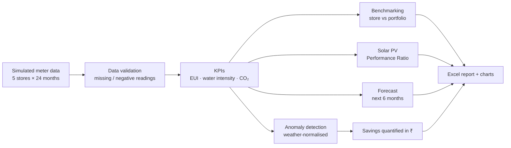
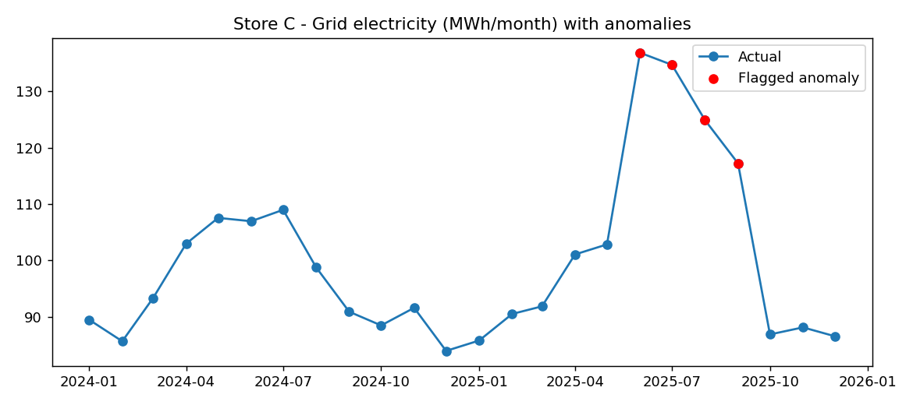
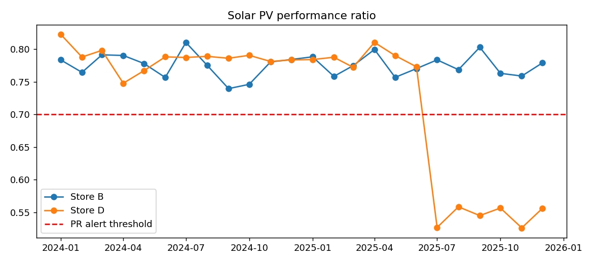
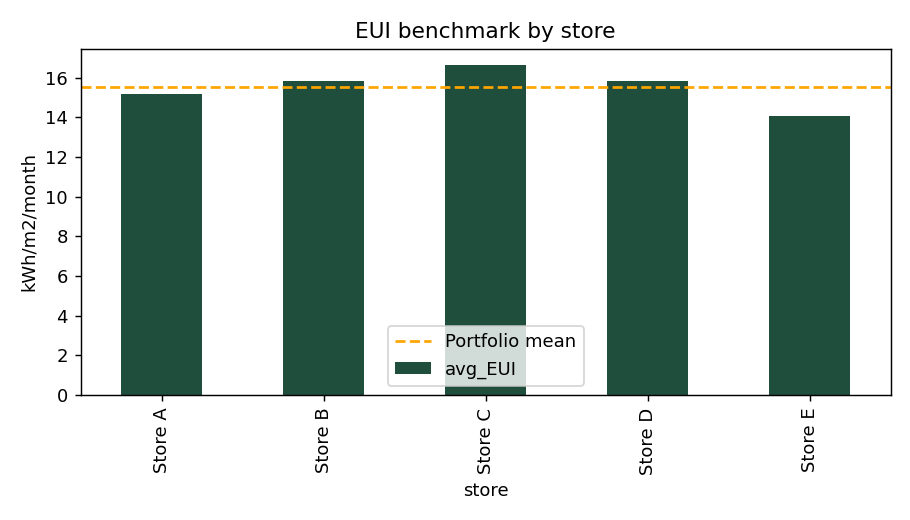

<div align="center">

# ⚡ Multi-Store Energy, Water & Solar Analytics

**Turning utility data into savings: validation, benchmarking, anomaly detection, solar monitoring and forecasting for a retail portfolio.**


</div>

---

## 🎯 Why this project?

Energy analysts in retail spend their days answering questions like:

- *Which store is using more energy than it should, and why?*
- *Is this month's bill high because of the weather, or because something is wrong?*
- *Is our solar system actually performing as expected?*
- *How much money is the waste costing us?*

This project is my attempt to answer those questions end to end: from messy meter readings to a clean report that a facility team can act on.

> **Transparency note:** the data is **simulated**. I planted known faults (a water leak, an HVAC baseload rise, an abnormal diesel generator run, a solar inverter fault) so I could test whether the method finds them. The emission factor and tariffs are **assumptions** and should be replaced with real values (see [Assumptions](#-assumptions)).

---

## 🧭 What it does



| Module | What it does |
|---|---|
| **Data validation** | Finds missing and negative readings, logs each one, and corrects them by interpolation |
| **KPIs** | Energy Use Intensity (kWh/m²), water intensity (L/m²), CO₂ from grid electricity and diesel |
| **Benchmarking** | Compares each store with the portfolio average |
| **Anomaly detection** | Regression against temperature, then robust z-scores (MAD) on the residuals, so seasonal swings aren't mistaken for faults |
| **Solar PV monitoring** | Monthly Performance Ratio (actual ÷ expected output); alerts when PR < 0.70 |
| **Forecasting** | 6-month projection using trend + monthly seasonality, built on a baseline that excludes flagged anomalies |
| **Savings quantification** | Converts excess kWh, kL and litres into ₹ using assumed tariffs |

---

## 📊 Results

### Planted faults and what the code found

| Planted issue | Detected? | Excess found | Cost impact |
|---|:---:|---|---|
| HVAC / baseload rise, **Store C** (Jun–Sep 2025) | ✅ | ≈ 76,000 kWh | ≈ ₹6.1 lakh |
| Water leak, **Store B** (Mar 2025) | ✅ | ≈ 409 kL | ≈ ₹16,000 |
| Abnormal diesel generator run, **Store E** (Aug 2025) | ✅ | ≈ 504 L | ≈ ₹45,000 |
| Inverter / soiling fault, **Store D** solar (from Jul 2025) | ✅ | PR ≈ 0.54 vs ≈ 0.78 normal | ≈ 30% generation loss |

**Total excess flagged: ≈ ₹7.6 lakh** across electricity, water and diesel.

> ⚠️ Detection is statistical, so there are a few false alarms (for example, Store B electricity in May 2025). In real life a facility team would verify each flag on site. I kept them visible instead of hiding them.

### Charts

<table>
<tr>
<td align="center"><b>Store C: electricity with flagged anomalies</b><br></td>
<td align="center"><b>Solar PV Performance Ratio</b><br></td>
</tr>
<tr>
<td align="center" colspan="2"><b>Energy Use Intensity benchmark by store</b><br></td>
</tr>
</table>

---

## 🚀 How to run

### Option A: Google Colab (no installation)

1. Open [colab.research.google.com](https://colab.research.google.com) and create a **New notebook**
2. Upload `energy_analytics.py` using the folder icon on the left
3. In a cell, run:
   ```python
   !python energy_analytics.py
   ```
4. Open the `outputs/` folder in the file panel to download `energy_report.xlsx` and the charts

### Option B: On your computer

```bash
git clone https://github.com/<your-username>/energy-analytics.git
cd energy-analytics
pip install pandas numpy matplotlib openpyxl
python energy_analytics.py
```

**Output** (created in an `outputs/` folder):

- `energy_report.xlsx` with sheets for EUI benchmark, anomalies, savings summary, solar alerts, forecast, data validation log and clean data
- `store_c_anomaly.png`, `eui_benchmark.png`, `solar_pr.png`

---

## 🧮 Method in brief

**Energy Use Intensity**

```
EUI = (grid kWh + solar kWh) / floor area (m²)
```

**Carbon**

```
CO₂ (t) = (grid kWh × 0.71 + diesel litres × 2.68) / 1000
```

**Anomaly detection**

1. Fit `kWh = a + b × max(temp − 24, 0)` for each store (weather normalisation)
2. Compute residuals and a robust spread using the median absolute deviation (MAD)
3. Flag months where the robust z-score exceeds 3

**Solar Performance Ratio**

```
PR = actual output / (capacity kWp × irradiation kWh/m²/day × days)
```

---

## 📌 Assumptions

| Item | Value used | Note |
|---|---|---|
| Grid emission factor | 0.71 kg CO₂e/kWh | Approximate; replace with the latest [CEA CO₂ Baseline Database](https://cea.nic.in) value |
| Diesel emission factor | 2.68 kg CO₂e/litre | Standard value for diesel |
| Electricity tariff | ₹8 / kWh | Assumed commercial tariff |
| Water tariff | ₹40 / kL | Assumed |
| Diesel price | ₹90 / litre | Assumed |
| Anomaly threshold | robust z > 3 | Adjustable in the code |
| Solar PR alert | PR < 0.70 | Adjustable in the code |

---

## ⚠️ Limitations

- Data is **simulated**; real meter data has noise, gaps and operating patterns this does not capture
- Weather is a single temperature proxy; real work would use degree-days from actual weather data
- Demand charges (kVA), power factor and tariff slabs are not modelled yet
- Forecasting is a simple regression model; it is a baseline, not a production forecast

---

## 🛣️ Roadmap

- [ ] Run the pipeline on a **real public building energy dataset**
- [ ] Add kVA demand, power factor and time-of-day tariff analysis
- [ ] Degree-day normalisation with real weather data
- [ ] Build an interactive dashboard (Streamlit or Power BI)
- [ ] Add automated data-quality checks and unit tests
- [ ] Extend to Scope 1 and 2 reporting formats

---

## 🙋 About me

I'm **Aditi Fadnavis**, a Computer Science undergraduate with Product Management experience, learning to apply data analytics to energy efficiency and sustainability in retail.

📧 aditifadnavis5@gmail.com · 🔗 [LinkedIn](https://www.linkedin.com/in/aditifadnavis)

Feedback is welcome. I'd love to hear how this could better reflect how real energy teams work.

---

<div align="center"><sub>Built as a learning project · simulated data · not for operational use</sub></div>
